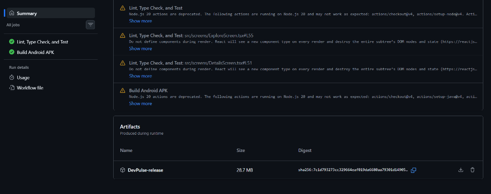

<div align="center">
  
  <h1>DevPulse</h1>
</div>

A React Native app that lets you browse and search trending GitHub repositories. It supports offline caching so your data sticks around even after you close the app.

## What it does

- **Explore** - shows a paginated list of trending repos from the GitHub API with infinite scroll
- **Dual-Mode Search** - search for both dynamic repositories OR active developers/users natively via a top segment toggle (using debounced input so it doesn't spam the API)
- **Details** - tap any repo or user to see stars, forks, issues, language, etc., or launch their external GitHub profiles
- **Favorites** - save repos you like and view them later from the header
- **Offline support** - data gets cached to AsyncStorage when the app goes to background, and restored on next launch

## Download & Preview

You don't need to build the app locally to test it! A pre-compiled Android APK is generated automatically via GitHub Actions:
1. Go to the **Actions** tab in this GitHub repository
2. Click on the latest workflow run (e.g. "Lint, Type Check, and Test")
3. Scroll to the bottom to the **Artifacts** section
4. Download the `DevPulse-release` zip file, extract the APK, and install it on your Android device/emulator



## How to run

Make sure you have React Native CLI set up (Node, Android Studio / Xcode).

```bash
npm install

# android
npm run android

# ios (macOS only)
cd ios && pod install && cd ..
npm run ios
```

## Tech decisions

- **No Expo, no UI libraries** - just React Native CLI with core components like FlatList, RefreshControl, StyleSheet etc.
- **Redux Toolkit** for state - manages trending repos, search results and favorites in separate slices. Chose RTK over plain Redux to cut down on boilerplate
- **Custom hooks** - `useDebounce` for search input, `useAppState` for detecting background/foreground transitions. Keeps the screen components clean
- **Manual persistence over redux-persist** - I write to AsyncStorage explicitly when the app backgrounds instead of on every state change. Avoids unnecessary writes and keeps the JS thread free during renders
- **TypeScript throughout** - all navigation params, API responses and Redux state are typed. Catches bugs early and makes refactoring safer

## What I'd improve with more time

- Switch to RTK Query or React Query for data fetching - would handle caching, retries and pagination more cleanly
- Add proper unit tests with jest and integration tests with @testing-library/react-native
- Deep linking so you can open a repo detail screen from a URL
- Error boundary component to catch unexpected crashes gracefully
- Add Sentry or Crashlytics for production error tracking
